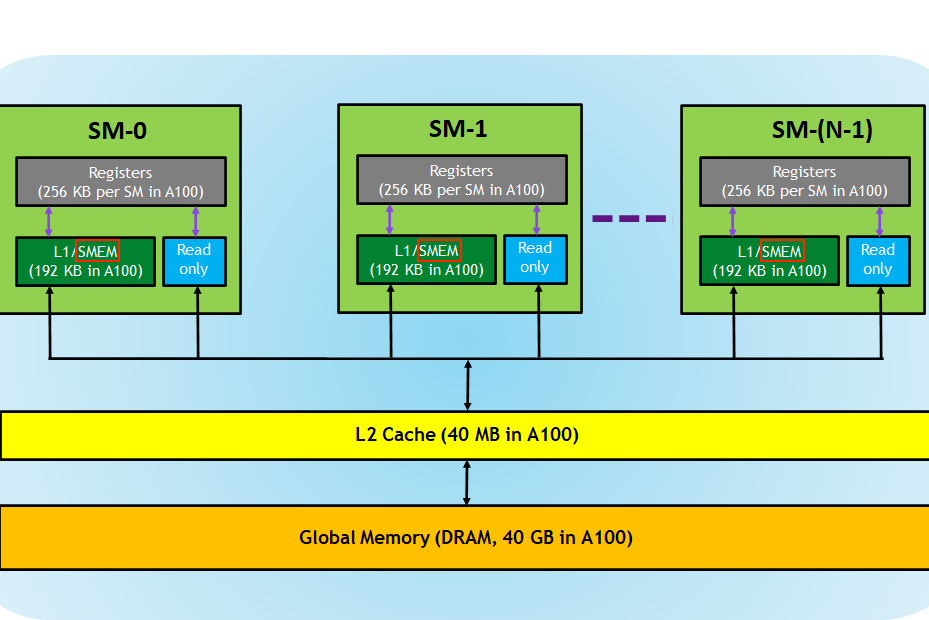
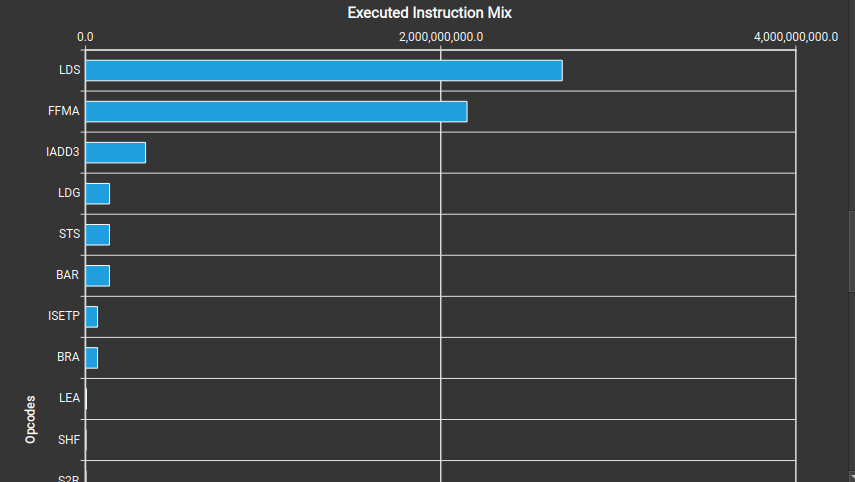
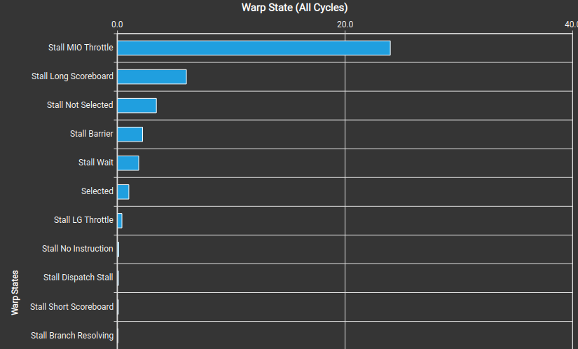
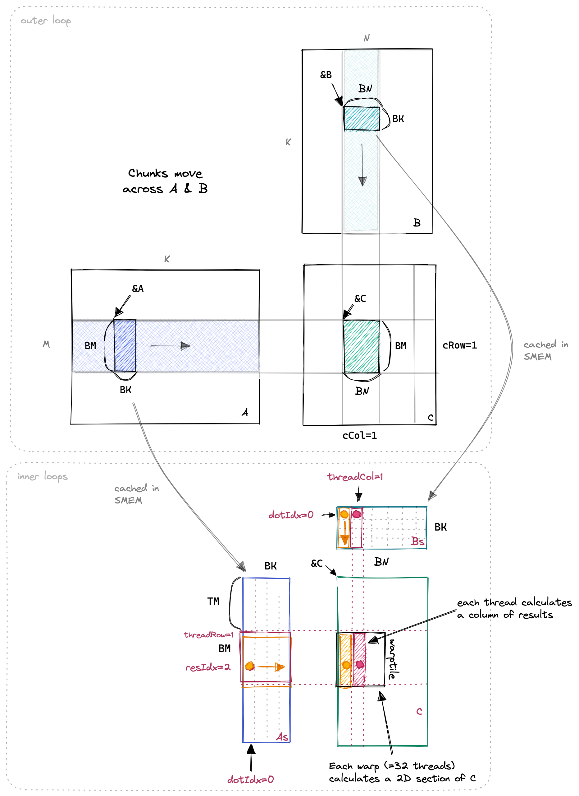
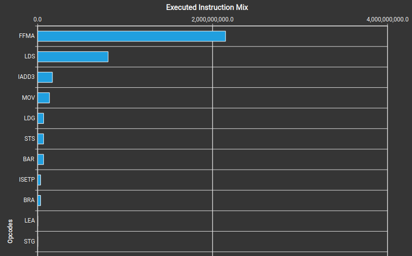
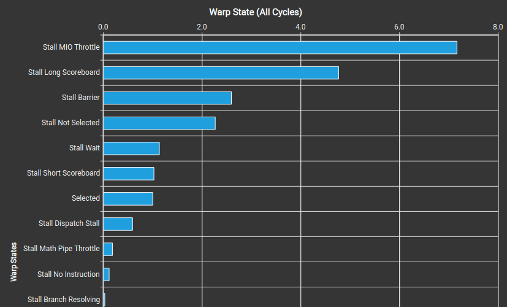

# Matmul

### Goal: Acheive close to state-of-the-art preformance with custom kernel that is understandable and simple

- I will be following an Anthropic Kernel engineer's guide (siboehm)

## Kernel v1: Naive

- We implement a naive matrix multiplication with a for-loop and 2-d threads and blocks. Each thread combines it's block ID and thread ID to get its overall point in the matrix (IE: thread.x + block.x*dim.x is its x chord), and then each element is computed as the dot product of the correspinding collumn of the 2nd matrix and row of the 1st. 

        // Naive kernel
        __global__ void sgemm_naive(int m,int n,int k,float alpha, float *A, float* B,float beta,float *C){

            // position in mat for thread
            int x = threadIdx.x + blockIdx.x * blockDim.x; // row
            int y = threadIdx.y + blockIdx.y * blockDim.y; // col
            

            if (y < n && x < m) {
                // dot product of ith row m1/ jth col i2
                float tmp = 0;
                for(int l = 0; l < k; l++) {
                    tmp += A[x*n + l] * B[y + l*n];
                }
                C[x*n + y] = tmp;
            }

        }

### Information about memory and FLOPS
- Lets keep track of how many operations we are doing, and how much memory we are reading. (assume we are multiplying 2 4092^2 matrices and then adding a 4092^2 matrix)
- Remember that since memory and math overlap in GPU's, the thing that takes longer will be our bottleneck(giving us ops/bytes ratio)

1. FLOPS for matmul: 2*4096^3 (for each element we have a fused multiply-add which multiplies and adds to a running sum in one go) + 4092^2 flops for addition
 = 137.5G flops
2. 67.1MB of memory to read 3*(4029^2), and 201MB 4092^2 write
3. Our GPU (A100) has 19.5TFLOPS of compute bandwith for F32, and 1,935GB/S memory bandwith. 

This means that our read/write to memory will take about 268/1,935 miliseconds (0.13) to read/write, and 137.5/19.5 (7) miliseconds

### ***Issue 1*** memory acess pattern of naive kernel
- Two kernels in the same block sometimes load the same row (ie: 0,0, 0,1), or the same collumn, however, they are doing this completely independently of eachother. This means we are reading much more memory than necessary.
- This means we acheive much lower FLOPS (time); but in reality, our memory is limiting us hugely.
    (our flops are : 2*4096^3+4096^2 / 0.43 =>300Gflops :( )
#### Warps
- Each SM processes a thread block, and 'warps' are the actual groups of threads that are processed together. They are 32 threads long, and are indexed on the 'unravelled matrix' (think indexing dimensions in memory: x*dimy + y). So in our 32x32 blocks, there are 32 warps.
- However, while we were discussing memory in terms of 'row-major' before, where y represented continous memory (or the last dim), now we are collumn-major, where x represents continous memory  (actuall_id = x + y*dimx)

This matters, because in a warp, multiple sequential memory acesses ***can be combined into 1***

## Kernel V2 Coalescing warp memory
- So, we clearly need similar warps to acess similar rows, meaning that our dimensions in our thread blocks should match those of our matrices.
- In this code, each threadIdx actually controls the y-axis on the grid, but this is what controls the continuous memory in the matrix (its inverted), so we allign the warp memory and the loaded memory from the rows that we can share within a warp

        // Coalescing global memory
        __global__ void sgemm_coalesced(int m,int n,int k,float alpha, float *A, float* B,float beta,float *C){

            // x down and to the side
            const int x = blockIdx.x*BLOCK_SIZE + 
            (threadIdx.x/BLOCK_SIZE); // how far down within a block (to side!)
            // side and down (reverse on grid)
            const int y = blockIdx.y*BLOCK_SIZE + 
            (threadIdx.x%BLOCK_SIZE); // how far to l/r in block (down!);
            

            if (y < n && x < m) {
                // dot product of ith row m1/ jth col i2
                float tmp = 0;
                for(int l = 0; l < k; l++) {
                    tmp += A[x*n + l] * B[y + l*n];
                }
                C[x*n + y] = tmp*alpha + beta*C[x*n+y]; // adding and multiplying
            }

        }
- We acheive about 3.5x more flops here!
> [NOTE]
>
> Here, we only coalesce the global memory (meaning loading from our ram to our sms). Dram holds the most memory, and the subsequent lower levels of memory are smaller, but faster.

## Kernel V3

- Looking at this picture, we can see that smem is the local memory that each SM stores, meaning thread blocks can acess it.
- Intuitively, this on-chip memory is much faster, with lower latency, due to the the fact that it is physically closer to the threads which are accessing from it.
- So, ideally we would load the entire matrix into the shared memory, but since the space is finite, we will load chunks and then do work on them with our threads in our block, and then load more. The fast speed of the smem more than makes up for having 2-loading periods (for threads, and for the smem)

1. My SM supports about 164KB per load.
2. So, given a 32x32 thread-block, we're going to sequentially load the jth collumn of m2, and the ith collumn of m1. Since we need to load the entire 'K' row for m1 and col for m2, but only the 32 long/wide chunk (think of the 'strip' that we target with our thread-block), we basically scan across m1 loading 32X32 chunks of the row-strip, and the same for m2 with the collumn strip. 

Cacheing memory with smem (each thread loads a number)

        __global__ void smem_shared(int m,int n,int k,float alpha, float *A, float* B,float beta,float *C){
            // we load in chunks to our shared memory for a block to work on
            // for our A matrix, 32 high, 64 wide
            // for B, 32 wide, 64 long
            const int cRow = blockIdx.x; // pos. in grid
            const int cCol = blockIdx.y;

            const int threadRow = threadIdx.x / BLOCK_SIZE; // what y would be
            const int threadCol = threadIdx.x % BLOCK_SIZE;

            // adv. pointers to 'starting positions'
            A += cRow * BLOCK_SIZE * K;
            B += cCol * BLOCK_SIZE;
            C += cRow*BLOCK_SIZE*N + cCol*BLOCK_SIZE;

            float tmp = 0.0; // store temporary dot prod.

            // memory for local cache --> not a ptr-
            __shared__ float As[BLOCK_SIZE*SMEM_CHUNK_SIZE];
            __shared__ float Bs[BLOCK_SIZE*SMEM_CHUNK_SIZE];

            // outer-loop to advance our smem-block
            for (int bkIdx = 0; bkIdx < K; bkIdx+=SMEM_CHUNK_SIZE) {
                // each thread loads a part of As and Bs
                // as threadIdx increments, we want to increment-
                //-global memory for global coalescing to work
                As[threadRow*BLOCK_SIZE + threadCol] = A[threadRow*K + threadCol]; // changes by 1 with collumn
                Bs[threadRow*BLOCK_SIZE + threadCol] = B[threadRow*N + threadCol]; // skipping over all other elements in A/B

                __syncthreads(); // finish memory loading

                // updating A/B positions to start of next block
                A += SMEM_CHUNK_SIZE;
                B += SMEM_CHUNK_SIZE*N;

                // dot product for  (temporarily stored in smem) block
                for (int l = 0; l<SMEM_CHUNK_SIZE; l++) {
                    tmp += As[threadRow*SMEM_CHUNK_SIZE + l] * 
                    Bs[threadCol + l*SMEM_CHUNK_SIZE];
                }
                __syncthreads();

            }
            C[threadRow*N + threadCol] = alpha*tmp + beta*C[threadRow*N + threadCol];

        }

 We acheive a ~35% spedup! (49ms --> 30ms)

> Note
>
> \_\_shared\_\_ means smem being loaded in a pointer
> __synchthreads() is used so all the threads finish their jobs before the next step because each thread loads a part of the memory

### Further notes on memory usage
- Notice that although our GPU could handle much more than 32x32x4 byte chunks, we kept the number much lower. This is because, when we max out the SMEM on our SM, we loose the ability to store multiple blocks.

- Each SM is only executing one warp at a time, however having multiple blocks is very helpful because it switches between warps rapidly, and warps will often be waiting for memory to load or until other operations finish, so it is helpful to have high *occupancy*, or many thread blocks in queued in any given SM
    - However, there are limits to how many blocks we can load onto an SM at one time:
    1. As we saw SMEM is limited per SM, so we can't use too much per block
    2. Register Count
    3. Warp Count

> Registers are local variables that are local to the thread, and therefore even faster. then smem (shared within block) They store constants and information about what a thread should do. 

So, if we have too many registers, we can't run many threads concurrently, and if we use too much SMEM per block, we will exceed the maximum capacity. Also, there is a max number of warps (maxThreads/warpSize) we can have due to hardware limitations.

Work assigned to an sm has a scheduling granularity (size) of blocks. Furthermore, registers are loaded in multiples of 256 which have warp granularity.

We can use:

    nvcc -arch=sm_89 -Xptxas -v my_program.cu -o run

to get this information.

Now, we get an output which tells us the information about each threads register usage (35), and each thread blocks sm usage.

> So, given the memory usage, threads, and registers we use, we can now calculate the bottleneck of the amount of blocks we can load into an sm (and calculate occupancy: #warps in sm / total warp capacity)

        SMEM max blocks = 100kb/8 + 1(runtime usage)kb = 11 blocks
        Regs/waps = 37*32 = 1280 (1184 rounded up) *32 = 4096 --> 1 block
        Warps max blocks = 48/32 => 1 block

We can only load 1 block at a time, however, we acheive an occupancy of 32/48, which is considered decent.

---------------------------------------------------------------------------------
#### *Aside*: Analyzing Kernels with profiler
Lets run nsys profile to get information about our kernel. First we must include our nvtx push and pop commands to store information about specific kernels and operations.

        nvcc -o run matmulV3.cu -lnvToolsExt
        ncu --set detailed -o report ./run
        (choose betw: basic,roofline,detailed,full)

this gives us in-depth information about how our kernel behaves and what is happening within each sm. The profiler will give us detailed information about our kernel, and we will be able to see each memory load, operation, and look for any bottlenecks.

Now, we can open up the ncu ui, and dig into the information that our profile generated.

1. ***Executed Instruction Mix***

Here is the 'instruction mix' for our kernel.

1. LDS are memory loads.
2. FMA are fused multiply-adds (in our dot product)
3. IADD3 are our pointer additions

Looks like we are spenting a disproportional amount of our instructions loading memory.

If we want to look further we can run this to see the compiler code

        nvcc -ptx matmulV3.cu

        output:
        ...
        ld.shared.f32 	%f11, [%r5+128];
        ld.shared.f32 	%f12, [%r4+4];
        fma.rn.f32 	%f13, %f12, %f11, %f10;
        ld.shared.f32 	%f14, [%r5+256];
        ld.shared.f32 	%f15, [%r4+8];
        fma.rn.f32 	%f16, %f15, %f14, %f13;
        ...

there is a clear pattern of two loads and one fused multiply-add. This is a likely  problem as a given thread will spend more time waiting for memory rather than preforming operations.

We know that we should be compute-bound, but the two loads are undeniably taking more time than the fma, which loads information from the register almost instentaneously.

Furthermore, here are our ***warp state statistics***

Stall MIO throttle means our warp states are innactive waiting for some memory to load (memory input/output). This is not ideal, we do *not* want our warps idle at all. Ideally, since our problem is so compute intensive, they should almost always be preforming compute operations, and memory will be loading in during this.

>[KEY CONCEPT] 
> GPU's hide latency by de-activating a warp when it is waiting for memory and rapidly switching to another, meaning effectively the memory loading and computations happen concurrently (there is seperate hardware for loads, and ops). However, if there is a signficant memory wait time, then this will be the bottleneck. This is why the time taken to execute a kernel is given by: max(mem_time,compute_time).  
> Therefore, a compute bound GPU would look like: active warps taking a while to complete, while the memory is already loaded. While, a memory-bound would be rapidly completing operations, and switching to active kernels that still had not yet loaded their memory. 

Ok, now equipped with the information that our kernel is very memory-intensive on both the invidiual thread level, and the overall statistics of the active-warps, we can try to make our kernels more compute-heavy.

Now we just need to answer the question: how do we keep smem down, while doing more computations per thread?
---------------------------------------
>[NOTE] 
> ptx is compiler assembly-like code that gives the exact instructions for each thread. If there are abstractions like for-loops in cuda/C++ code, we can see exactly what is happening in the ptx code.  

>[NOTE] 
> Remember that our calculation of being compute bound is assuming that we do the minimum amount of loading from Dram. However, as long as we dont do 10x more than this minimum, we will acheive compute-boundeness, and no more optimization is possible for the memory
---------------------------------------
## Kernel V4: 1D blocktiling (multiple results per thread)
> our goal here to do more computations per thread for the smem that we load

In this next kernel, we still utilize SMEM cacheing and make sure that we group our loads with GMEM coalescing. However, a key difference is the block size. Each block will have 8x64 threads, which will calculate a 64x64 chunk
- Each thread will calculate 8 different elements
- We will save the ith element of the jth collumn the a given thread is calculating, and dot it with all of the first collumns (we'll have the row-loop inside the dot product loop) allowing us to store a value in Bs in the register for 8 calculations

So, in summary, each block will calculate a 64x64 chunk of the matrix. Each thread will calculate a 2d section of the block (8x1 elements), and we will still be sliding our block tile around the rows of A and collumns of B to cache info. in the smem.

Here is an illustration that really helps:

-----------------------------------------------------

-------------------------------------------------------

Here is the code:

        // smem cacheing + global mem coalescing + 1d blocktiling
        __global__ void blockTile1D(int m, int n, int k, float *A, float *B, float *C,int alpha,int beta){
            // defining our block position
            const int blockCol = blockIdx.x;
            const int blockRow = blockIdx.y;

            // defining how large our 'slides' will be
            // A: BMxBK, B: BK*BN
            const int BM = 64;
            const int BN = 64; 
            const int BK = 8;
            const int TM = 8;

            assert(BM*BN == TM*BK*BM); // making sure the number we calculate equal to number we must

            // getting pointers at starting position alligned w/block
            A += blockRow*BM*K;
            B += blockCol*BN;
            C += blockRow*BN*N + blockCol*BM;

            // defining how we load A/Bs with threads,
            // make sure we access continously, and shapes match
            const int threadRowA = threadIdx.x / BK;
            const int threadColA = threadIdx.x % BK;
            const int threadRowB = threadIdx.x / BN;
            const int threadColB = threadIdx.x % BN;

            // shared smem for As and Bs
            __shared__ float As[BM*BK];
            __shared__ float Bs[BN*BK];

            // temporary values of given thread at slide
            float tmp[TM] = {0.0};
            // block sliding for-loop
            for (int blckIdx = 0; blckIdx < K; blckIdx += BK) {
                // loading memory (see how continuous)
                As[threadRowA*BK + threadColA] = A[threadRowA*K + threadColA];
                Bs[threadRowB*BN + threadColB] = B[threadRowB*N + threadColB];
                __syncthreads(); // making sure memory loaded before computations

                // adjusting pointers for next-run
                A += BK;
                B += BK*N;

                // dot product outside (each ith/jth index)
                // inside we have the thread idx we calculate.
                // this is so we can re-use our B value
                for (int dotIdx = 0; dotIdx < BK;dotIdx++) {
                    // storing B value and doing 1st fmad with each col
                    float Btemp = Bs[threadRowB + dotIdx*BN];
                    for (int rowIdx = 0; rowIdx < TM; rowIdx++) {
                        tmp[rowIdx] += As[dotIdx + rowIdx*BK] * Btemp; // 1 load, 1 reg
                                    
                    }
                }
                __syncthreads(); // waiting for operations to complete before next mem load
            }
            // filling in block results with 8 results per thread
            const int cCol = threadIdx.x % BN;
            const int cRow = (threadIdx.x / BM) * 8; // leaving room for extra
            for (int Cidx = 0; Cidx < TM; Cidx ++) {
                C[cCol + cRow*N + N*Cidx] = alpha * tmp[Cidx] + beta * C[cCol + cRow*N + N*Cidx];
            }

        }

When I run this kernel, I get a 3x speedup! Furthermore, the instruction mix is much better (more Fmads), and warps spend less time stalled.

-----------------------------------------------------

------------------------------------------------------

> Note that the axis changes on the second warp state picture!

And as we can see in our ptx code:

        ld.shared.f32 	%f146, [_ZZ11blockTile1DiiiPfS_S_iiE2As+28];
        ld.shared.f32 	%f147, [%r5+1792];
        fma.rn.f32 	%f188, %f147, %f146, %f131;
        ld.shared.f32 	%f148, [_ZZ11blockTile1DiiiPfS_S_iiE2As+60];
        fma.rn.f32 	%f187, %f147, %f148, %f133;
        ld.shared.f32 	%f149, [_ZZ11blockTile1DiiiPfS_S_iiE2As+92];
        fma.rn.f32 	%f186, %f147, %f149, %f135;
        ld.shared.f32 	%f150, [_ZZ11blockTile1DiiiPfS_S_iiE2As+124];
        fma.rn.f32 	%f185, %f147, %f150, %f137;
        ld.shared.f32 	%f151, [_ZZ11blockTile1DiiiPfS_S_iiE2As+156];
        fma.rn.f32 	%f184, %f147, %f151, %f139;
        ld.shared.f32 	%f152, [_ZZ11blockTile1DiiiPfS_S_iiE2As+188];
        fma.rn.f32 	%f183, %f147, %f152, %f141;
        ld.shared.f32 	%f153, [_ZZ11blockTile1DiiiPfS_S_iiE2As+220];
        fma.rn.f32 	%f182, %f147, %f153, %f143;
        ld.shared.f32 	%f154, [_ZZ11blockTile1DiiiPfS_S_iiE2As+252];
        fma.rn.f32 	%f181, %f147, %f154, %f145;

inside our row-for-loop, since we stored our Btemp in a register, we only have 1 load per fma (fused multiply-add)!

This makes sense, because we use much less memory per result (each result is a fixed number of fmads).

        Memory acess per result in V3:
        GMEM: (K/32) iterations * 2 loads 
        SMEM: K/32 iterations * BK=32 * 2 loads
        == {K/16 GMEM, 2K SMEM} 
-------------------------------------------------------------------------------
        Memory acess per result in V3: (x8 bc 8 per thread)
        GMEM: (K/8 iterations * 2 loads) / 8 results
        SMEM: K/8 iterations * BK(=8) dot prod loop * (TM+1==9) 1B, 8 A's / 8 res.
        == {K/32 GMEM, 9K/8 SMEM}

So, clearly we are using less memory per result in V4, and our results make sense.

The GMEM makes sense, because we are calculating 64x64 results, and this means overall we have less 'overlap'
(ideally we would just load the entire matrix into smem, but this is not possible). The reduced smem usage
also makes sense; we are saving the Btemp value for our results, which saves us effectively half of our
smem loads.

Lets keep up our strategy of trying to load less memory and compute more things per thread.

> TODO: Why does multiple results per thread result in less memory usage?
